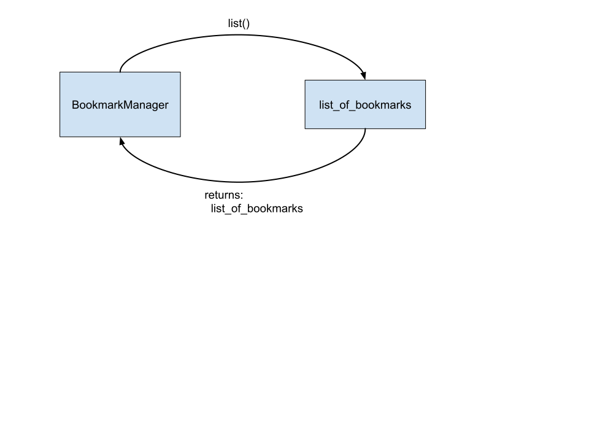

# Bookmark Manager

(https://github.com/makersacademy/course/tree/master/bookmark_manager)

## Creating User Stories

### Show a list of bookmarks

```sh
As a user
So that I can see my bookmarks
I''d like to see a list of my bookmarks

```

| Object         | Messages                           |  
| -------------  | ----------------------------       |
| `BookmarkManager`| `list()` - returns `list_of_bookmarks` |




## Database setup instructions

### Create `bookmark_manager` database:

```sql
CREATE DATABASE "bookmark_manager";
```

### Confirm `bookmark_manager` database was created:

```psql
student=# \l
                                    List of databases
       Name       |  Owner  | Encoding |   Collate   |    Ctype    |  Access privileges  
------------------+---------+----------+-------------+-------------+---------------------
 bookmark_manager | student | UTF8     | en_US.UTF-8 | en_US.UTF-8 |
 postgres         | student | UTF8     | en_US.UTF-8 | en_US.UTF-8 |
 student          | student | UTF8     | en_US.UTF-8 | en_US.UTF-8 |

```

### Connect to the database:

```psql
\c bookmark_manager
```

### Create `bookmarks` table in the `bookmark_manager` database:

```sql

CREATE TABLE bookmarks (id SERIAL PRIMARY KEY, url VARCHAR(60));

```

### Confirm `bookmarks` table was created:

```psql

bookmark_manager=# \dt
          List of relations
 Schema |   Name    | Type  |  Owner  
--------+-----------+-------+---------
 public | bookmarks | table | student
(1 row)

```

### Check the `bookmarks` table contains the required columns:

```psql

bookmark_manager=# SELECT * FROM bookmarks;
 id | url
----+-----
(0 rows)

```

## Manipulating Table Data

### Check the existing rows:

```psql

bookmark_manager=# SELECT * FROM bookmarks;
 id | url
----+-----
(0 rows)

```

### Create four links in the `bookmarks` table:

```sql
INSERT INTO bookmarks (url)
VALUES ('http://www.makersacademy.com');

INSERT INTO bookmarks (url)
VALUES ('http://askjeeves.com');

INSERT INTO bookmarks (url)
VALUES ('http://twitter.com');

INSERT INTO bookmarks (url)
VALUES ('http://www.google.com');

```

> Note: after each `INSERT` statement, the response is `INSERT 0 1`  
The `1` signifies number of records added. The `0` refers to OIDs (Object Identifiers).  
More info: https://www.postgresql.org/message-id/4AD5F063.8050708@iol.ie ; https://www.postgresql.org/docs/8.1/datatype-oid.html

### List the four entries using SELECT:

```sql
bookmark_manager=# SELECT * FROM bookmarks;
 id |             url              
----+------------------------------
  1 | http://www.makersacademy.com
  2 | http://askjeeves.com
  3 | http://twitter.com
  4 | http://www.google.com
(4 rows)

```

### Deleting the row with `http://twitter.com`:

```sql
bookmark_manager=# DELETE FROM bookmarks WHERE id=3;
DELETE 1

bookmark_manager=# SELECT * FROM bookmarks;
 id |             url              
----+------------------------------
  1 | http://www.makersacademy.com
  2 | http://askjeeves.com
  4 | http://www.google.com
(3 rows)

```

### Update the `http://askjeeves.com` link to `http://www.destroyallsoftware.com`

```sql

bookmark_manager=# UPDATE bookmarks
bookmark_manager-# SET url='http://www.destroyallsoftware.com'
bookmark_manager-# WHERE id=2;
UPDATE 1

bookmark_manager=# SELECT * FROM bookmarks;
 id |             url              
----+------------------------------
  1 | http://www.makersacademy.com
  4 | http://www.google.com
  2 | http://www.destroyallsoftware.com
(3 rows)
```

>Note it is possible to import from SQL files as follows, e.g.:  

```sql
psql bookmark_manager < ./db/migrations/02_populating_table_data.sql

```

## Interacting with PostgreSQL from Ruby

 TDD an update to the .all method of the Bookmark model, to do the following:  
 - Use PG to connect to the PostgreSQL bookmark_manager database.  
 - Retrieve all bookmark records from the bookmarks table.
 - Extract the URLs from the database response.

 ## Upgrading your toolset

```sql
INSERT INTO bookmarks
	VALUES (DEFAULT, 'http://www.apple.com');

UPDATE
	bookmarks
SET
	url = 'http://www.itv.co.uk'
WHERE
	url = 'http://www.bbc.co.uk';

DELETE FROM bookmarks WHERE url='http://www.itv.co.uk';

SELECT * FROM bookmarks WHERE id=7

```
## Setup Test Database

1.
```sql
CREATE DATABASE 'bookmark_manager_test'
```
2.
```sql
\c
CREATE TABLE bookmarks (id SERIAL PRIMARY KEY, url VARCHAR(60));
``` 
